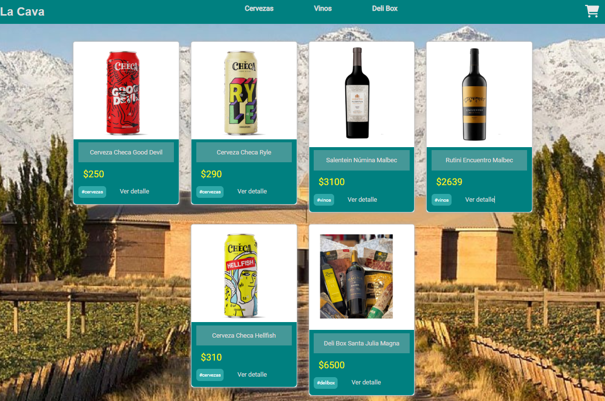

# Carrito de Compras "La Cava"
## Bebidas Nacionales e Importadas



Los Clientes pueden encontrar en este e-commerce los mejores precios en Bebidas Nacionales e Importadas, comprar facilmente y recibir el pedido donde lo soliciten.

## Librerías utilizadas
-   [React-fontawesome](https://fontawesome.com/v5/docs/web/use-with/react)  
    Esta libreria la uso para dibujar un CartWidget copado
-   [Firebase](https://firebase.google.com/)  
    Utilizo Firebase para alojar los productos disponibles y las Ordenes de Compra
-   [Bootstrap](https://react-bootstrap.github.io/getting-started/introduction)  
    Utilizo Bootstrap para la Barra de Navegación, para botones, Formulario de Compra y estilos proporcionadas por esta libreria para renderizar objetos en el DOM.
 -   [React-toastify](https://www.npmjs.com/package/react-toastify)  
    Utilizo Toastify para gestionar mensajitos chetos a los usuarios, como por ejemplo, cuando agregan productos al carrito.
 -   [React-sppiner](https://www.npmjs.com/package/react-spinners)  
    Utilizo Sppiner para gestionar los tiempos de carga.
 -   [Sweetalert2](https://sweetalert2.github.io/)  
    Utilizo Sweetalert2 para Confirmar o no el vaciado del carrito.
-   React-router-dom

## Funcionalidades del proyecto

El usuario puede: 
- Filtrar por categorias de bebidas
- Agregar las cantidades deseadas (siempre q haya stock)
-   Se pueden eliminar articulos del carrito
-   Al finalizar la compra el usuario completa el Formulario con los datos requerido para recibir su compra.

### Pasos para correr el proyecto en local

1. Clonar el repositorio

```
git clone https://github.com/SantiagoGomezWeb/PreEntrega2Gomez-
```

2. Abrirlo en algún editor de código (Visual Studio Code) e instalar las dependencias

```
npm install
```

3. Startear el proyecto localmente

```
npm start
```